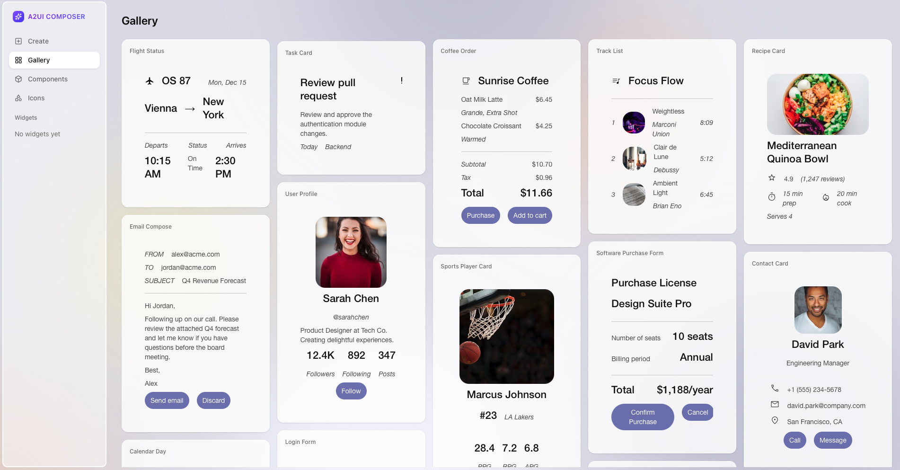

# A2UI Composer

Try building A2UI widgets interactively with the **CopilotKit A2UI Widget Builder**.

**[Launch Widget Builder →](https://go.copilotkit.ai/A2UI-widget-builder)**

## What it does

- Experiment with A2UI components visually
- Generate A2UI JSON by describing what you want
- See real-time previews
- Copy JSON to use in your agents

Built by the [CopilotKit](https://www.copilotkit.ai/) team.