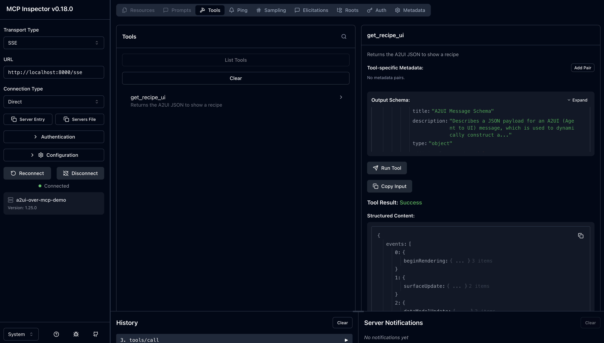

# A2UI over MCP Demo

A demo of A2UI running over MCP, exposing a tool that returns a recipe UI.

## Usage

1. Start the server using either stdio (default) or SSE transport:

```bash
# Using SSE transport (default) on port 8000
uv run .
```

The server exposes a tool named "get_recipe_ui" that accepts no arguments.

2. Inspect the server using the [MCP Inspector](https://github.com/modelcontextprotocol/inspector)

```bash
npx @modelcontextprotocol/inspector
```

Connect to http://localhost:8000/sse using Transport Type SSE and run the tool. You should see something like the screenshot below:

